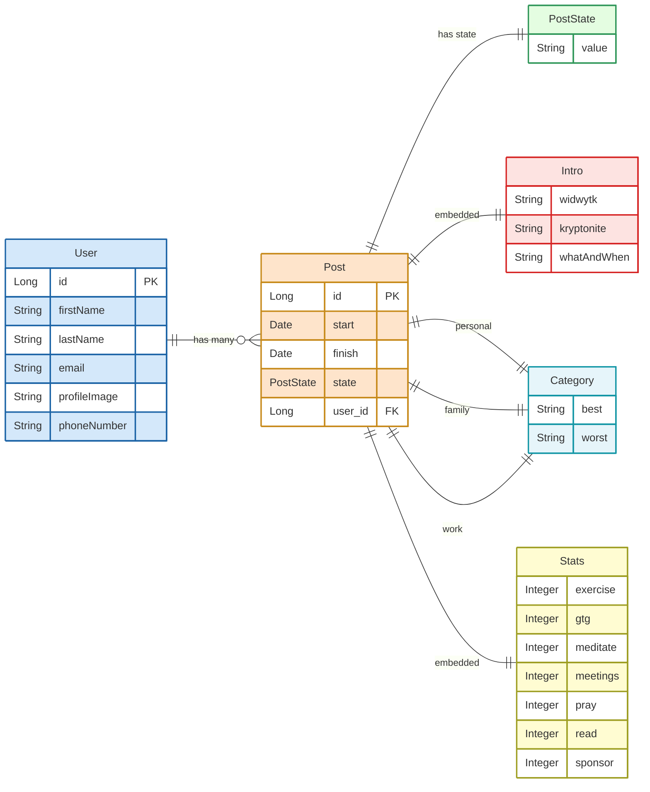

# Post Entity Relationship Diagram

## Relationship Summary

### Primary Relationships
- **User → Post**: One-to-Many relationship (`@OneToMany`)
  - One user can have multiple posts
  - Posts are mapped by the `user` field
  - Cascade operations: ALL

- **Post → User**: Many-to-One relationship (`@ManyToOne`)
  - Each post belongs to exactly one user
  - Required relationship (optional = false)

### Embedded Components
The Post entity contains several embedded objects that are stored as part of the Post table:

- **Intro**: Contains introduction fields (widwytk, kryptonite, whatAndWhen)
- **Category** (3 instances): 
  - Personal (personal_best, personal_worst columns)
  - Family (family_best, family_worst columns)
  - Work (work_best, work_worst columns)
- **Stats**: Contains various integer metrics for tracking activities

### Enum Relationship
- **PostState**: Enum with values IN_PROGRESS and COMPLETE

## Database Mapping
- All embedded objects use `@AttributeOverrides` to customize column names
- Text fields use `TEXT` column type for larger content
- Stats.read field maps to `_read` column to avoid MySQL keyword conflicts